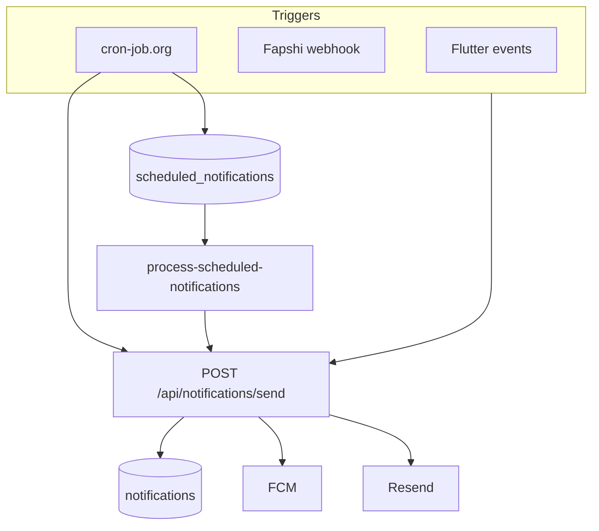

# PrepSkul notification system

## Architecture

**Hub:** `PrepSkul_Web/app/api/notifications/send/route.ts` — always creates in-app; push/email respect preferences, quiet hours, role checks (`notification-permission-service.ts`), and engagement opt-out.

**Scheduled:** Flutter/Web schedule routes insert into `scheduled_notifications` using **admin client**. `GET /api/cron/process-scheduled-notifications` (every 5–10 min) delivers due rows.

**Engagement:** `PrepSkul_Web/lib/notifications/*` orchestrator — contextual campaigns, Cameroon calendar, meaningful-activity gate (WAT), one engagement touch per day.

## Meaningful activity (no engagement nudge if true today, WAT)

- `profiles.last_seen` updated today (mobile `app_presence_service`)
- `individual_sessions` / `trial_sessions` activity
- SkulMate play (`skulmate_usage_events` or `user_game_stats.last_played_at`)
- Booking/payment updates or user sent a chat message

## Engagement priority (single pick per user per run)

1. Calendar special day (`calendar-cm.ts`)
2. Monday week-start (Monday WAT only)
3. Month start (1st WAT only)
4. Tutor pending verification / KYC resume / pay after KYC
5. Matched tutors digest (`ENABLE_DAILY_MATCHED_TUTORS=true`)
6. Behaviour: browsed tutors, no open booking
7. Notes → SkulMate game
8. SkulMate daily streak
9. Daily engagement boost (fallback)

## Role matrix (engagement)

| Campaign | student/learner | parent | tutor |
|----------|-----------------|--------|-------|
| Calendar / Monday / Month / daily boost | yes | yes | yes |
| Behaviour browse | yes | yes | no |
| SkulMate streak / notes→games | yes | yes* | no |
| Tutor verification | no | no | yes |

\*Parents may receive notes→games copy referencing child.

Transactional types (booking, session, payment, KYC) use email + push per type prefs; engagement types are **push + in-app only** by default.

## Adding a campaign

1. Add `CampaignId` + entry in `engagement-types.ts`
2. Add copy in `message-catalog.ts` and optional date in `calendar-cm.ts`
3. Wire priority in `pick-campaign.ts`
4. Optionally add thin cron route calling `runEngagementBatch` or `sendEngagementToUser`
5. Register job in `CRON_JOB_REGISTRY.md` and cron-job.org

## Flutter

- Transactional: `notification_helper_service.dart` → `/api/notifications/send`
- Session lifecycle: completed / cancelled / no-show → helper (push + email)
- Prefs: `notification_preferences.engagement_push_enabled` + UI toggle
- Tap routing: `notification_navigation_service.dart`

See also: `CAMEROON_ENGAGEMENT_CALENDAR.md`, `CRON_JOB_REGISTRY.md`, `EXTERNAL_CRON_SETUP.md`.
