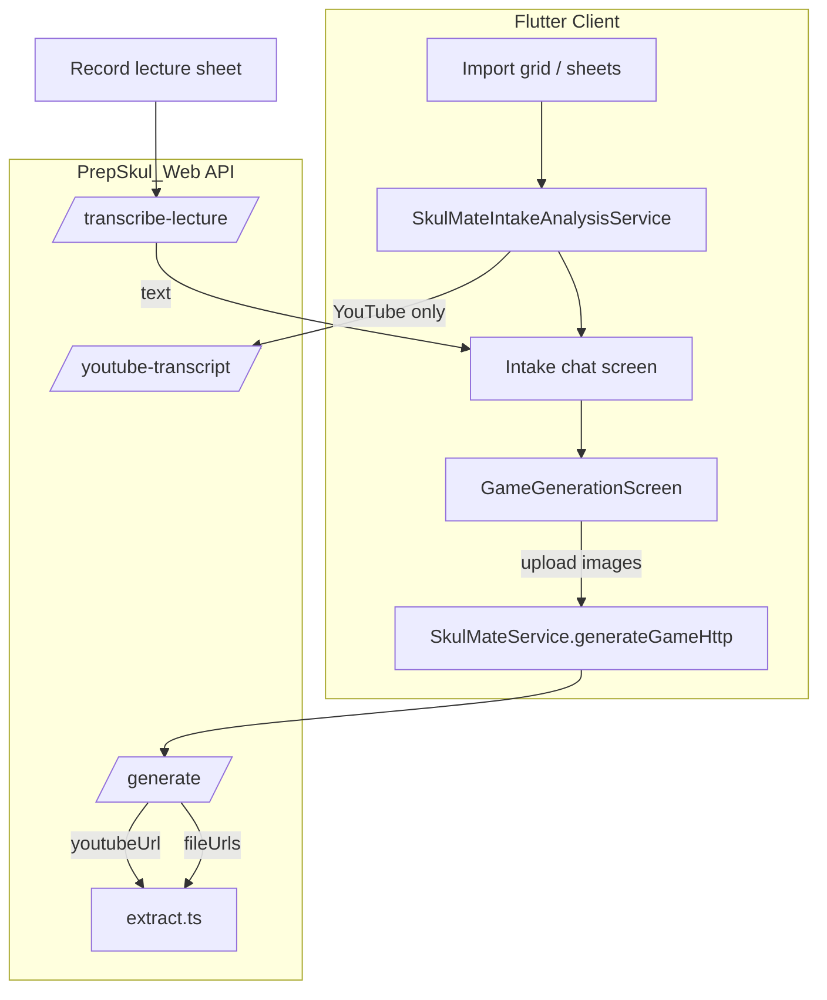

# SkulMate: Implementation Plan

**Goal:** A platform that does what it claims — reliable intake (photo, YouTube, recording), six working game types, adaptive surfaces only where backed by real content analysis. Fewer features, higher truth.

**Principle:** Fix the pipeline before polishing UX. No new game types until existing ones pass contract tests end-to-end.

**Last audited:** 2025-06-25 (mapped against `PrepSkul_Web` + `prepskul_app` source)

---

## 1. Current State (Codebase Truth)

### 1A. Photos / images

| Layer | What exists today | Gap vs product promise |
|-------|-------------------|------------------------|
| **Client upload** | `GameGenerationScreen` uploads 1–N images to Supabase `documents`, sends `fileUrls` + `sourceFileNames` via `SkulMateService.generateGameHttp` | Intake chat path routes through same screen via `SkulMateIntakeCoordinator` — multi-photo works when `imagesToUpload.length > 1` |
| **Server intake** | `generate/route.ts` normalizes `fileUrl` + `fileUrls[]`, downloads each, calls `extractFile` per image, joins segments with `[Image N Context]` prefixes | Download failures return generic 500 without `errorCode` |
| **Extraction** | `lib/skulmate/extract.ts`: OCR attempts (signed source URL, handwriting prompt, base64 variants, temp storage URL) then **visual fallback** (`extractVisualConceptFromImageSkulMate`) — not OCR-only | OCR attempts still gated by `isMeaningfulOcrText` (≥10 chars, ≥2 tokens); visual fallback is a separate prompt, not a unified `LearningArtifact` |
| **Budget** | `MAX_VISION_CALLS_PER_IMAGE = 8`, model rotation via `VisionCallBudget` | No per-request alert when budget exhausted |
| **Post-extract QA** | `assessExtractionQuality` + `buildExtractionQualityPromptSection` wired into generate prompt; flags `visual_fallback`, persists in game metadata | Does **not** force flashcards or `needsSourceVerification` on low confidence |
| **Errors** | `OCR_TEXT_EXTRACTION_FAILED`, `IMAGE_PROVIDER_AUTH` (502), `IMAGE_PROVIDER_UNAVAILABLE` (503); short extract (&lt;20 chars) returns 400 **without** `errorCode` | User draft assumed OCR blocks before vision — **partially wrong**: vision fallback exists but is last-resort, not multimodal-first |
| **Intake chat analysis** | `SkulMateIntakeAnalysisService`: photos → generic label `intakeTopicFallbackPhoto` ("Photo") — **no vision call** | UI implies Gizmo-style understanding before generate |

**Key files**

- `PrepSkul_Web/lib/skulmate/extract.ts`
- `PrepSkul_Web/app/api/skulmate/generate/route.ts` (lines ~1516–1693)
- `PrepSkul_Web/lib/skulmate/extraction-quality.ts`
- `prepskul_app/lib/features/skulmate/screens/game_generation_screen.dart`
- `prepskul_app/lib/features/skulmate/services/skulmate_intake_analysis_service.dart`

---

### 1B. YouTube

| Layer | What exists today | Gap |
|-------|-------------------|-----|
| **Dedicated API** | `POST /api/skulmate/youtube-transcript` → `fetchYoutubeTranscript` | No tests |
| **Inline in generate** | `generate/route.ts` calls same `fetchYoutubeTranscript` when `youtubeUrl` set and no `text` | Duplicate path; client may fetch transcript twice (analysis + generate) |
| **Extraction chain** | (1) Scrape `youtube.com/watch` HTML → parse `captionTracks` JSON → fetch `baseUrl` timedtext XML (2) Fallback timedtext URLs: `lang=en`, `lang=en&kind=asr`, `lang=fr` | No `youtube-transcript` npm / third-party API fallback |
| **Errors** | `YOUTUBE_URL_REQUIRED`, `YOUTUBE_TRANSCRIPT_TOO_SHORT` (422), `YOUTUBE_TRANSCRIPT_UNAVAILABLE` (422) | No `YOUTUBE_NO_CAPTIONS` vs scrape-failure distinction |
| **Client** | `SkulMateService.resolveYoutubeTranscript` + `_mapErrorCodeToException` for YouTube codes; intake analysis uses first transcript line as topic | Intake chat has no dedicated paste-notes CTA on YouTube errors (generic error panel) |
| **Tests** | None for `youtube-transcript.ts` | Needed |

**Key files**

- `PrepSkul_Web/lib/skulmate/youtube-transcript.ts`
- `PrepSkul_Web/app/api/skulmate/youtube-transcript/route.ts`
- `prepskul_app/lib/features/skulmate/services/skulmate_service.dart` (`resolveYoutubeTranscript`, error mapping)

---

### 1C. Lecture recording

| Layer | What exists today | Gap |
|-------|-------------------|-----|
| **Client record** | `SkulMateRecordLectureSheet` → `SkulMateLectureRecordingService` (m4a) | **No minimum duration** before upload/transcribe |
| **Client transcribe** | Upload to `documents` bucket → signed URL → `POST /api/skulmate/transcribe-lecture` → delete temp audio | — |
| **Server** | `DeepgramClient.transcribeFromUrl`; `MIN_TRANSCRIPT_LENGTH = 50`; persists row in `skulmate_lecture_transcripts` | Catch-all `TRANSCRIPTION_FAILED` (500); no `DEEPGRAM_AUTH`, `AUDIO_UNREACHABLE` |
| **Post-transcribe flow** | Text passed to `SkulMateIntakeCoordinator.start` with `SkulMateIntakeSource.lecture` — **does not re-transcribe on generate** | ✓ Correct |
| **Error code** | Server: `TRANSCRIPT_TOO_SHORT` (not `AUDIO_TOO_SHORT`) | Client maps 422 to generic message only |

**Key files**

- `PrepSkul_Web/app/api/skulmate/transcribe-lecture/route.ts`
- `PrepSkul_Web/lib/services/transcription/deepgram.client.ts`
- `prepskul_app/lib/features/skulmate/widgets/skulmate_record_lecture_sheet.dart`
- `prepskul_app/lib/features/skulmate/services/skulmate_lecture_transcription_service.dart`

---

### 1D. Paste / topic / PDF

| Path | Status |
|------|--------|
| Paste text | `validateGenerateIntake` requires ≥50 chars unless topic-only mode |
| Topic-only | Supported (`topic` field, `isTopicOnlyMode`) |
| PDF/DOCX/TXT | `extractFile` → Ticha extractors; same generate pipeline |

---

### 1E. Games

| Layer | What exists today | Gap |
|-------|-------------------|-----|
| **Released list (client)** | `SkulMateClientGamePolicy.releasedApiTypes`: quiz, flashcards, matching, fill_blank, drag_drop, puzzle_pieces | `comingSoonTypes` set still exists (9 types) — blocked at `skulmate_game_router` / launcher, not removed from enum |
| **Released list (server)** | `RELEASED_AUTO_GAME_TYPES` — **same 6 types**; `pickReleasedAutoGameType` filters auto recommendations | ✓ Aligned for auto mode |
| **Setup UI** | `GenerationContextSheet` uses `setupSelectableApiTypes` = auto + 6 only | ✓ Already honest in setup picker |
| **Server explicit request** | `validGameTypes` still includes match3, word_search, crossword, etc.; prompts still describe unreleased types | **No `GAME_TYPE_NOT_SHIPPED` rejection** — API can still generate unreleased types if client requests them |
| **Playability** | `GameModel.isPlayable` (Dart only); `GameGenerationScreen` retries with `autoStableApiTypes` on failure | **No server-side validator** before persist; broken games can be saved |
| **Compiler** | Monolithic prompt in `generate/route.ts` (~2000 lines) | No `game-compiler.ts` / contract tests |

**Key files**

- `prepskul_app/lib/features/skulmate/utils/skulmate_client_game_policy.dart`
- `prepskul_app/lib/features/skulmate/models/game_model.dart` (`isPlayable`)
- `PrepSkul_Web/app/api/skulmate/generate/route.ts` (`RELEASED_AUTO_GAME_TYPES`, `validGameTypes`, prompts)

---

### 1F. Adaptive / modes (today)

| Feature | Status |
|---------|--------|
| Spaced repetition | `lib/skulmate/spaced-repetition.ts` + tests — exists |
| Scroll feed | Client screen exists; depends on successful generation |
| Genui catalog | Client-side; not wired to real post-understand artifact |
| Intake modes | Play, drill, scroll, path all selectable (`isComingSoonMode` → `false`) |
| Admin ops | `SkulMateOpsClient` — generation insights, weak topics, parent progress, pricing — **not** intake failure rates by `errorCode` |

---

## 2. Product Contract (Ship This, Hide the Rest)

### Shipped capabilities (user-visible)

| Capability | Code status | Target |
|------------|-------------|--------|
| Photo intake (1–N images) | Multi-upload + vision pipeline exists; intake analysis shallow | Understand content → generate study material |
| PDF / document upload | Works via extractors | Extract text → generate |
| Paste notes / topic | Works | Generate from text |
| YouTube (with captions) | Scrape + timedtext fallbacks | Transcript → generate; clear error when no captions |
| Lecture recording | Deepgram path works when env set | Transcribe → generate; clear error when too short |
| Game types | 6 released; setup UI limited | Only: quiz, flashcards, matching, fill_blank, drag_drop, puzzle_pieces |
| Modes | Play, drill, scroll (+ path) | Play, drill, scroll feed |
| Adaptive UI | Partial (extraction QA in prompt only) | Genui driven by real content structure (Phase 3) |

### Explicitly not shipped (remove from API + any remaining UI)

`diagram_label`, `match3`, `bubble_pop`, `word_search`, `crossword`, `simulation`, `mystery`, `escape_room`

### Error contract (every intake path)

Structured `errorCode` + actionable user message. Known codes today:

| Code | Where |
|------|-------|
| `OCR_TEXT_EXTRACTION_FAILED` | generate (image) |
| `IMAGE_PROVIDER_AUTH` / `IMAGE_PROVIDER_UNAVAILABLE` | generate (image) |
| `YOUTUBE_URL_REQUIRED` / `YOUTUBE_TRANSCRIPT_TOO_SHORT` / `YOUTUBE_TRANSCRIPT_UNAVAILABLE` | youtube-transcript + generate |
| `TRANSCRIPT_TOO_SHORT` / `TRANSCRIPTION_FAILED` | transcribe-lecture |

**Missing:** `GAME_TYPE_NOT_SHIPPED`, `YOUTUBE_NO_CAPTIONS`, `AUDIO_TOO_SHORT`, `DEEPGRAM_AUTH`, `AUDIO_UNREACHABLE`, `errorCode` on short image extract (400 today)

---

## 3. Architecture Decision

Replace four separate brittle paths with one server concept:

```
IntakeBundle → Understand → LearningArtifact → Compile → Validate → Persist
```

```
┌─────────────┐     ┌──────────────────┐     ┌─────────────────┐
│ IntakeBundle│────▶│ Understand pass  │────▶│ LearningArtifact│
│ (images,    │     │ (multimodal LLM, │     │ concepts, terms,│
│  text, yt,  │     │  OCR optional)   │     │ relations, conf)  │
│  audio)     │     └──────────────────┘     └────────┬────────┘
└─────────────┘                                        │
                                                       ▼
                                              ┌─────────────────┐
                                              │ Game compiler   │
                                              │ (6 types only)  │
                                              └────────┬────────┘
                                                       │
                                                       ▼
                                              ┌─────────────────┐
                                              │ isPlayable check│
                                              │ (server-side)   │
                                              └─────────────────┘
```

**Industry-standard choices**

- **Multimodal-first, OCR-enhancement** — Today: OCR-first with visual fallback last. Phase 1A inverts: understand pass primary; OCR supplements.
- **Server-side validation before save** — Today: client `isPlayable` only.
- **Single capability manifest** — Today: two lists aligned for auto (`RELEASED_AUTO_GAME_TYPES` ≈ `releasedApiTypes`) but server `validGameTypes` and prompts still mention unreleased types.
- **Graceful degradation** — Today: `extraction-quality` adjusts prompt; no flashcard forcing.
- **Observability** — Debug ingest hooks exist (`SKULMATE_DEBUG_INGEST_URL`); no aggregated failure dashboard.

---

## 4. Phased Implementation

### Phase 0 — Deploy + Honesty (3–5 days)

**Objective:** Stop lying in the product. Ship code already written.

| # | Task | Where | Done when | Codebase note |
|---|------|-------|-----------|---------------|
| 0.1 | Deploy `PrepSkul_Web` to production | Vercel | Device logs show `fileUrls` on multi-photo; structured errors not raw 500 | `fileUrls`, error codes, visual fallback already in repo — verify prod lag |
| 0.2 | Verify env on Vercel | Dashboard | Health probe 200 per dependency | `SKULMATE_OPENROUTER_API_KEY`, `DEEPGRAM_API_KEY`, `SUPABASE_SERVICE_ROLE_KEY` |
| 0.3 | Hide unreleased game types everywhere user selects type | Client | User cannot select unreleased types | **Setup picker already limited** via `setupSelectableApiTypes`; audit library/marketing for stale copy |
| 0.4 | Server: reject unreleased `gameType` with `GAME_TYPE_NOT_SHIPPED` | `generate/route.ts` | API returns 400 for word_search, etc. | **Not implemented** — `validGameTypes` still accepts unreleased |
| 0.5 | Align released lists | Both repos | Diff is zero | **Already aligned** for the 6 types + auto |

**Acceptance:** Photo of printed notes → game generates on production. Setup shows only 6 types + auto.

---

### Phase 1 — Reliable Intake (1.5–2 weeks)

**Objective:** All four intake paths work or fail with clear, correct errors.

#### 1A. Images — multimodal understand pass

| # | Task | Where | Codebase note |
|---|------|-------|---------------|
| 1.1 | Add `understandImageBundle(urls[])` → `{ summary, concepts[], perImageEvidence[], confidence }` | New `lib/skulmate/understand.ts` (or extend `extract.ts`) | Visual fallback is ad-hoc text, not structured artifact |
| 1.2 | In `generate/route.ts`: if OCR fails or `!isMeaningfulOcrText`, run understand pass; merge OCR + vision | `generate/route.ts` | Visual fallback already runs inside `extractImage` — refactor, don't duplicate |
| 1.3 | Return `OCR_TEXT_EXTRACTION_FAILED` only when both OCR and understand return empty/low confidence | `generate/route.ts` | Add `errorCode` to short-extract 400 branch |
| 1.4 | Confirm client sends `fileUrls` from intake chat path | `game_generation_screen.dart` | **Already sends** when `imagesToUpload.length > 1` |
| 1.5 | Medium confidence (&lt;0.6): prefer flashcards, tag `needsSourceVerification: true` | generate + client display | `extraction-quality` exists — extend to client metadata |

**Acceptance:** 10-image test set — ≥80% playable flashcards or quiz; 0% false `OCR_TEXT_EXTRACTION_FAILED` on readable content.

#### 1B. YouTube — resilient transcript

| # | Task | Where | Codebase note |
|---|------|-------|---------------|
| 1.6 | Integration test with 3 known-caption videos | `__tests__/skulmate/youtube-transcript.test.ts` | **No tests today** |
| 1.7 | Fallback chain: (a) captionTracks (b) timedtext API (c) optional npm fallback | `youtube-transcript.ts` | (a)+(b) **already exist** |
| 1.8 | `YOUTUBE_NO_CAPTIONS` vs `YOUTUBE_TRANSCRIPT_UNAVAILABLE` | `youtube-transcript/route.ts` | Both collapse to `YOUTUBE_TRANSCRIPT_UNAVAILABLE` today |
| 1.9 | Client: paste-notes CTA on `YOUTUBE_*` errors | `skulmate_intake_chat_screen.dart` | Error mapping exists in service; UI CTA missing |

**Acceptance:** Captioned video works. No-captions video shows specific error + paste fallback.

#### 1C. Recording — transcribe path

| # | Task | Where | Codebase note |
|---|------|-------|---------------|
| 1.10 | Verify Deepgram + signed Supabase URL from Vercel | `transcribe-lecture/route.ts` | Path implemented; env-dependent |
| 1.11 | Structured errors: `AUDIO_TOO_SHORT`, `AUDIO_UNREACHABLE`, `TRANSCRIPTION_FAILED`, `DEEPGRAM_AUTH` | route + client | Only `TRANSCRIPT_TOO_SHORT`, `TRANSCRIPTION_FAILED` today |
| 1.12 | Client min recording duration (~15s) before upload | `skulmate_record_lecture_sheet.dart` | **Not implemented** |
| 1.13 | Transcript through intake analysis → generate (no re-transcribe) | coordinator | **Already correct** |

**Acceptance:** 30s clear speech → flashcards. 5s recording → `AUDIO_TOO_SHORT` before API call.

---

### Phase 2 — Game Compiler + Contract Tests (1 week)

**Objective:** Generated games always play. No post-save deletion.

| # | Task | Where | Codebase note |
|---|------|-------|---------------|
| 2.1 | Extract `compileGame(artifact, gameType)` from monolithic prompt | `lib/skulmate/game-compiler.ts` | Prompt in `generate/route.ts` |
| 2.2 | Port `isPlayable` to TypeScript server validator | `lib/skulmate/game-playability.ts` | Dart: `game_model.dart` |
| 2.3 | Failed validation: retry once, then fallback to flashcards | `generate/route.ts` | Client retries unreleased/broken today |
| 2.4 | Per-type contract tests | `__tests__/skulmate/game-contracts/` | 13 skulmate tests exist; none for game schemas |
| 2.5 | Fix schema mismatches (puzzle `correctPosition`, drag_drop item shape) | prompts + Dart parsers | Known pain points |
| 2.6 | Auto mode: only released list | compiler | **Partial** — `pickReleasedAutoGameType` exists |

**Scope cut:** If `drag_drop` or `puzzle_pieces` fail contract tests after 2 retries, remove from shipped list until fixed. Ship 4 rock-solid types rather than 6 broken ones.

**Acceptance:** CI runs 6 contract tests — all green. Manual smoke: each type completes one round on device.

---

### Phase 3 — Adaptive UX (Genui, Real Analysis) (1–1.5 weeks)

**Objective:** UI adapts to content structure, not filenames.

| # | Task | Where | Codebase note |
|---|------|-------|---------------|
| 3.1 | `POST /api/skulmate/analyze-intake` | new route | **Does not exist** |
| 3.2 | Replace client-only photo/doc analysis with API | `skulmate_intake_analysis_service.dart` | Photos → "Photo" label today |
| 3.3 | Intake chat: real summary + mode chips from `suggestedModes` | `skulmate_intake_chat_screen.dart` | — |
| 3.4 | Wire genui to flashcard drill | `skulmate_genui_catalog.dart` | — |
| 3.5 | Scroll feed modality picker from `contentShape` | `skulmate_scroll_feed_screen.dart` | — |
| 3.6 | Spaced repetition ↔ `LearningArtifact` concepts | `spaced-repetition.ts` | Logic exists; wire end-to-end |

**Acceptance:** 3 biology photos → intake chat shows real topic + summary before generate.

---

### Phase 4 — Ops + Truth in Marketing (ongoing, 2–3 days initial)

| # | Task | Codebase note |
|---|------|---------------|
| 4.1 | Admin: intake failure rates by `errorCode` + source type | Extend `SkulMateOpsClient` / new API |
| 4.2 | Alert when vision budget exceeded per request | `MAX_VISION_CALLS_PER_IMAGE = 8` exists |
| 4.3 | App store / in-app copy matches 6 game types | Audit needed |
| 4.4 | Remove "coming soon" badges where types are hidden | `comingSoonTypes` still in policy file |

---

## 5. Dependency Checklist (Before Phase 1)

| Env var | Required for | Verified in code |
|---------|--------------|------------------|
| `SKULMATE_OPENROUTER_API_KEY` | Vision, generation | `extract.ts`, generate |
| `OPENROUTER_API_KEY` | Fallback key | `getSkulMateApiKeys()` |
| `SKULMATE_IMAGE_MODEL` | Diagram illustrations (optional) | `illustration-generator.ts`; default `black-forest-labs/flux.2-klein-4b` |
| `SKULMATE_INLINE_ILLUSTRATIONS` | Generate images during `/generate` (slow) | Default off; client fetches on-demand when `needsImage` |
| `DEEPGRAM_API_KEY` | Lecture recording | `DeepgramClient` |
| `SUPABASE_SERVICE_ROLE_KEY` | Signed URL download, transcript persist | generate, transcribe |
| `NEXT_PUBLIC_SUPABASE_URL` | Storage, auth | — |
| Client: `AppConfig.skulMateHttpApiBase` | Points to production API | `app_config.dart` |

---

## 6. What We Are Not Doing (Scope Lock)

- New game types (match3, crossword, etc.)
- Real-time streaming generation UI — defer until Phase 3 stable
- Offline OCR on device
- YouTube audio download + Whisper — only if caption fallback insufficient after Phase 1B
- Escape room, simulation, mystery narratives
- Parent digest / tutor escalation changes — already built; don't touch unless intake works

---

## 7. Success Metrics

| Metric | Target (30 days post Phase 2) |
|--------|-------------------------------|
| Image intake → playable game | ≥85% |
| YouTube (captioned) → playable game | ≥90% |
| Recording (≥30s speech) → playable game | ≥85% |
| Games deleted by `isPlayable` after save | 0% |
| User-facing failure without `errorCode` | &lt;5% |
| Shipped game types in UI | ≤6, all contract-tested |

---

## 8. Execution Order (Critical Path)

```
Phase 0 (deploy + API honesty for game types)
    → Phase 1A (images — refactor to understand-first)
    → Phase 1B + 1C (YouTube + recording) [parallel]
    → Phase 2 (compiler + contracts)
    → Phase 3 (adaptive UX)
    → Phase 4 (ops)
```

**First concrete action:** Deploy Phase 0 to production and run one device test per intake type (photo, PDF, paste, YouTube with captions, YouTube without, 30s recording). Failures then classify as deploy lag vs architecture.

**Phase 0 delta from draft plan:** Client setup UI (0.3) is largely done; prioritize **0.4 server `GAME_TYPE_NOT_SHIPPED`** and **production deploy verification (0.1–0.2)**.

---

## 9. Can We Be That Good?

Yes — but only by narrowing the promise:

- **Gizmo-level photo intake** requires multimodal understand (Phase 1A), not better OCR alone. Visual fallback exists but is not the primary path.
- **Adaptive learning** requires a stable `LearningArtifact` (Phase 2) before genui surfaces mean anything.
- **Games** means six types that always open — or four if two fail contract tests.
- **YouTube** means "works when captions exist" until a paid transcript API is justified.

That is an honest, industry-standard adaptive platform: reliable ingestion → structured content → validated output → UI that reflects structure. Not more features — fewer, working ones.

---

## Appendix A — Intake flow (as implemented)



## Appendix B — Released game type manifest (canonical)

```ts
// Server: generate/route.ts — RELEASED_AUTO_GAME_TYPES
// Client: skulmate_client_game_policy.dart — releasedApiTypes
['quiz', 'flashcards', 'matching', 'fill_blank', 'drag_drop', 'puzzle_pieces']
```

Keep these identical. Server must reject any other explicit `gameType` request (Phase 0.4).
